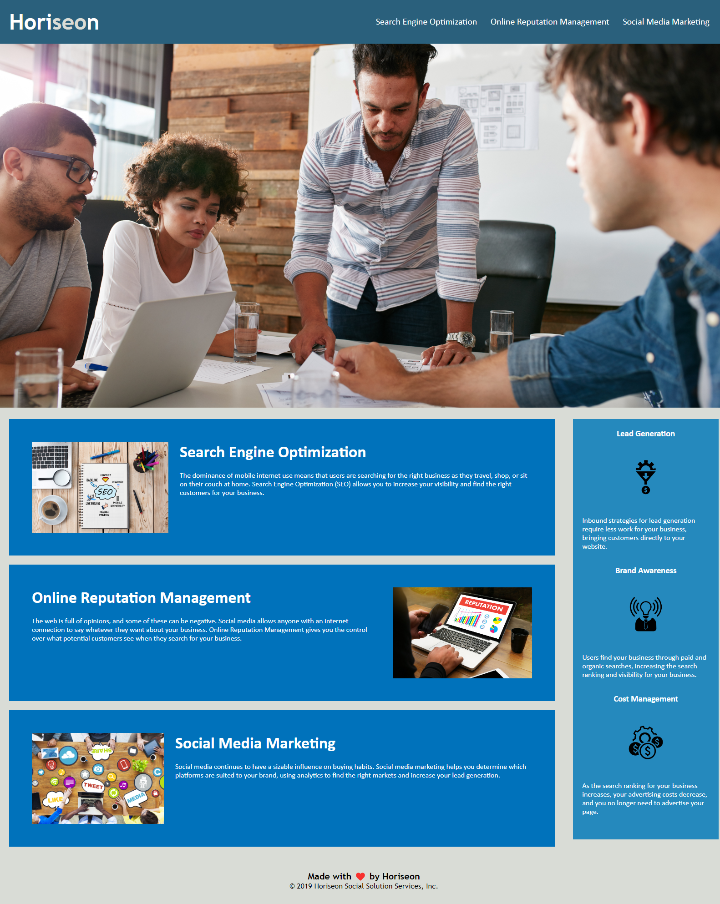

# Challenge 1 SEO

## Description

AS A digital company, I WANT to increase accesibility of website and improve code base, SO THAT the website is better optimized for search engines and to improve the longevity of the website's code.

This project aims to improve upon the website by optimizing it better for search engines, and to increase the longevity of the code with improvements to the code base.

Examples of changes that I made are:
* Adding alt attributes to img elements.  
* Putting descriptive comments into CSS.
* Fixing the a elements in the header to link properly.

## Usage

Provides an example homepage of a marketing company.

